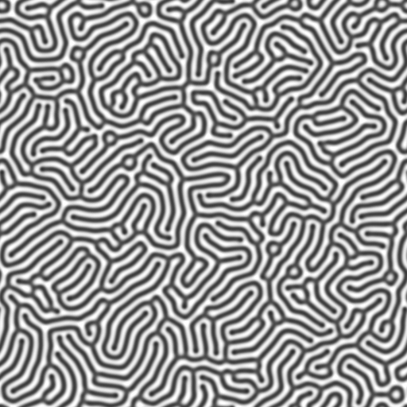
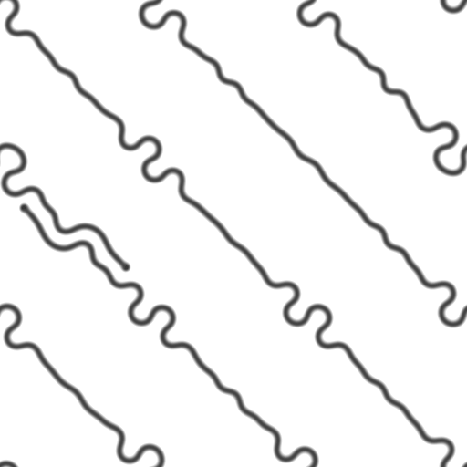

# Emergent Behaviour

A few simulation experiments displaying complex behaviour emerging from simple rules.

## Collision avoidance

A JS implementation recreating this bug I saw on youtube https://www.youtube.com/watch?v=SqpIcsN0FTI

A basic collision system, but without conservation of momentum. When balls collide, their momentum doesn't change, they just get moved to the side. Over time, the balls will find stable orbits without collisions.
[Live version](https://missing-user.github.io/emergent_behaviour/stableOrbits/)

## Reaction-Diffusion

Here's a reaction diffusion simulation utilizing the Gray-Scott model:
[Live version](https://missing-user.github.io/emergent_behaviour/reactionDiffusion/)
A few screenshots with interesting results I got:

## Physarum

WIP a slime mold simulation using millions of agents
[Live version](https://missing-user.github.io/emergent_behaviour/physarum/)
